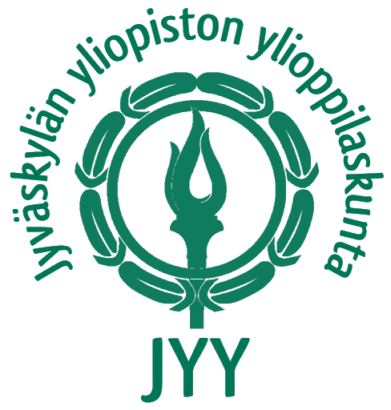
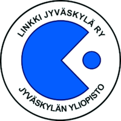
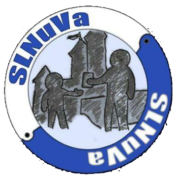

I am an Information Technology student at [University of Jyväskylä](https://www.jyu.fi/en) and a Full Stack Software Developer currently working at [Protacon](https://www.protacon.com/en/). My professional passion is in Information security & Offensive security though in free time I also enjoy working with various techologies, Hifi equipment and cars.

<!-- Include the library. -->

<!-- Optionally, include the theme (if you don't want to struggle to write the CSS) -->
<link
  rel="stylesheet"
  href="/assets/css/github-calendar-responsive.css"
/>

<!-- Prepare a container for your calendar. -->

    <!-- Loading stuff -->
    Loading the data.

## Experience

### Software Developer

#### Protacon

##### Jan 2019 - Current

Full stack software development of supply chain management system [Protacon Once®](https://www.protacon.com/en/once/) using many different technologies, e.g., PHP, .NET Core, Javascript, Angular and MSSQL.

### Salesperson

#### Storm Motor Oy

##### May 2018 - Jul 2018

Sales of motorcycle aftermarket parts, helmets and other equipment.

### Trainee

#### Savonlinna Works Oy, ANDRITZ group

##### Jul 2015 - Jul 2015, Jun 2016 - Jun 2016

Analyzed features and properties of the document management and storage system SharePoint and the security risks of internal communications and the field of suppliers.

## Education

### Information Technology

#### University of Jyväskylä

##### Sep 2016 - Current

Bachelors thesis on [Cybersecurity vulnerabilities of self driving vehicles](http://urn.fi/URN:NBN:fi:jyu-201907023532) (in Finnish).

### Upper secondary school

#### Savonlinnan Lyseon lukio

##### 2013 - 2016

Matriculation examination 2016

## Volunteering

### Deputy Member of The Council of Representatives

#### The Student Union of the University of Jyväskylä - Jyväskylän yliopiston ylioppilaskunta

##### Jan 2020 - Dec 2021

The Council of Representatives is the Parliament of the Student Union and, as such, decides on the most important issues concerning the Union and its members. The Council is comprised of 41 representatives which are elected by the student body every other year.

Among other things, the Council has power over the rules, budgets, financial statements, loans and building projects of the Student Union. The Council also appoints the Board of Executives, its chair and the key staff of the Student Union, such as its Secretary General and Editor-in-Chief.

### Vice Chairman Of The Board

#### Linkki Jyväskylä ry

##### Jan 2018 - Dec 2018

[Linkki Jyväskylä ry](https://linkkijkl.fi/) is a sizeable student association for Mathematical Information Technology, and Educational Technology majors and minors in University of Jyväskylä. Association was founded back in 2006 and it operates Faculty of Information Technology, within the Student Union of the University of Jyväskylä.

Purpose of the association is act as gateway for students to the faculty, promote the community of its members, to provide various opportunities for hobbies and peer learning, and to support the progress of their members’ studies.

### Member & Graphics Designer

#### Savonlinna Youth Council

##### Jan 2014 - Dec 2015

Savonlinna Youth Council (Savonlinnan nuorisovaltuusto) is a politically and religiously non-partisan, municipal group that promotes the interests of local youth. The role of the Youth Council is to: Promote opportunities for participation, influence and action by young people. It works under the auspices of the Board of Education and brings the young people's perspective to the preparation and decision-making of the city.

## Skills

### Programming Languages

* PHP
* C# / .NET Core
* Javascript
* Angular
* MSSQL
* Java, C, C++
* Python
* HTML & CSS

### Software & hardware

* Windows
* Linux (Arch, Debian) & Shell (Bash, Zsh)
* Git and SVN
* Raspberry Pi & IoT

### Industry knowledge

* Information Technology
* Scrum
* Software & Web development
* Information security & cybersecurity
* Power Plants
* Waste Management